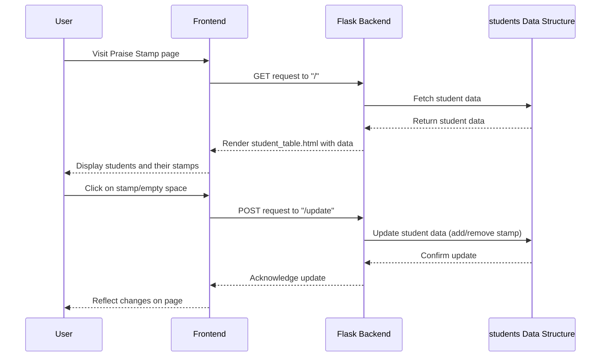

# ChatGPT
ChatGPT활용 온라인헬퍼 챗봇 개발 
개발자 도구 mermaid > UML 변환

칭찬도장찍기 프로그램

```mermaid
sequenceDiagram
    participant User as User
    participant Frontend as Frontend
    participant Backend as Flask Backend
    participant Data as students Data Structure

    User->>Frontend: Visit Praise Stamp page
    Frontend->>Backend: GET request to "/"
    Backend->>Data: Fetch student data
    Data-->>Backend: Return student data
    Backend-->>Frontend: Render student_table.html with data
    Frontend-->>User: Display students and their stamps
    
    User->>Frontend: Click on stamp/empty space
    Frontend->>Backend: POST request to "/update"
    Backend->>Data: Update student data (add/remove stamp)
    Data-->>Backend: Confirm update
    Backend-->>Frontend: Acknowledge update
    Frontend-->>User: Reflect changes on page

```
